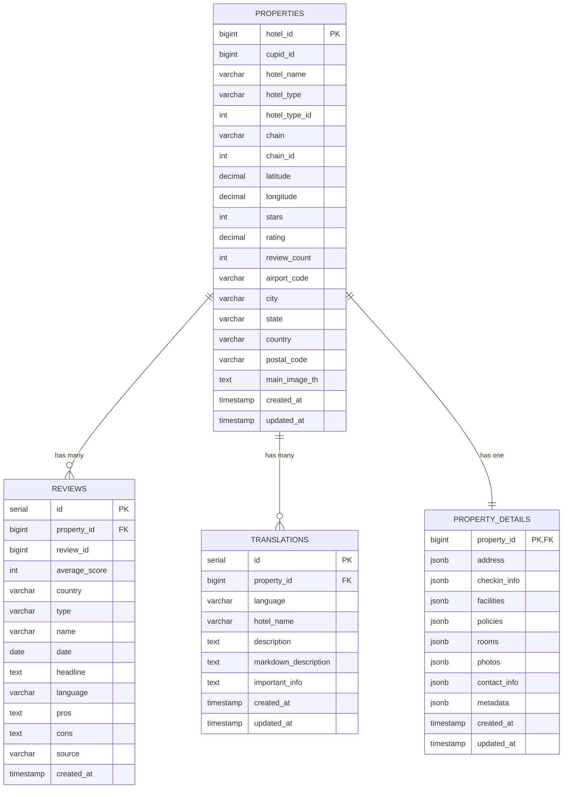

# 🏨 Cupid Hotel API

A comprehensive hotel property API that fetches and serves hotel data from the Cupid API with reviews, translations, and advanced search capabilities. Built with Go, PostgreSQL, and Docker.

## 📋 Overview

The Cupid Hotel API is a robust microservice that:

- **Fetches hotel data** from the Cupid Travel API
- **Stores and manages** property information, reviews, and translations
- **Provides RESTful endpoints** for hotel search and data retrieval
- **Synchronizes data** automatically with configurable intervals
- **Supports Docker deployment** with PostgreSQL database
- **Includes comprehensive testing** and monitoring capabilities

## 🚀 Quick Start

### Prerequisites

- Go 1.25+ (for local development)
- PostgreSQL 12+ (for local development)
- Docker & Docker Compose (for containerized deployment)
- Valid Cupid API key

### Option 1: Docker Deployment (Recommended)

1. **Clone and setup**:

   ```bash
   git clone https://github.com/barimehdi77/cupid-api
   cd cupid-api
   ```

2. **Configure environment**:

   ```bash
   cp docker.env.example docker.env
   # Edit docker.env and set your CUPID_API_KEY and your database credentials
   ```

3. **Start with Docker**:

   ```bash
   ./docker-startup.sh
   ```

4. **Access the API**:
   - API: <http://localhost:8080/api/v1>
   - Swagger UI: <http://localhost:8080/docs/index.html>
   - Health Check: <http://localhost:8080/api/v1/health>

### Option 2: Local Development

1. **Setup database** (see [Database Setup Guide](READMEs/DATABASE_SETUP.md))

2. **Configure environment**:

   ```bash
   cp .env.example .env
   # Edit .env with your database and API credentials
   ```

3. **Install dependencies**:

   ```bash
   go mod download
   ```

4. **Run migrations**:

   ```bash
   make migrate-up
   ```

5. **Start the server**:

   ```bash
   make run
   ```

## 🏗️ Architecture

### Core Components

- **API Server** (`cmd/api/`) - RESTful API with Gin framework
- **Data Fetcher** (`cmd/fetch/`) - Standalone tool to populate database
- **Cupid Client** (`internal/cupid/`) - Integration with Cupid Travel API
- **Storage Layer** (`internal/store/`) - Database operations and queries
- **Sync System** (`internal/sync/`) - Automatic data synchronization
- **Database** - PostgreSQL with migration support

### Key Features

✅ **Hotel Data Management** - Properties, reviews, translations  
✅ **Advanced Search** - Filtering, pagination, sorting  
✅ **Automatic Sync** - 12h/24h intervals or manual triggers  
✅ **Docker Support** - Complete containerized deployment  
✅ **API Documentation** - Swagger/OpenAPI integration  
✅ **Comprehensive Testing** - Unit, integration, and performance tests  
✅ **Monitoring** - Health checks, logging, and statistics  

## 📚 API Endpoints

### Core Endpoints

| Method | Endpoint | Description |
|--------|----------|-------------|
| `GET` | `/api/v1/health` | Health check and system status |
| `GET` | `/api/v1/properties` | List all properties with pagination |
| `GET` | `/api/v1/properties/{id}` | Get specific property details |
| `GET` | `/api/v1/properties/{id}/reviews` | Get property reviews |
| `GET` | `/api/v1/properties/{id}/translations` | Get property translations |
| `GET` | `/api/v1/search` | Search properties with filters |

### Admin Endpoints

| Method | Endpoint | Description |
|--------|----------|-------------|
| `POST` | `/api/v1/admin/sync` | Trigger immediate data sync |
| `POST` | `/api/v1/admin/sync/start` | Start automatic sync |
| `POST` | `/api/v1/admin/sync/stop` | Stop automatic sync |
| `GET` | `/api/v1/admin/sync/status` | Get sync status |
| `GET` | `/api/v1/admin/sync/health` | Get sync health |
| `GET` | `/api/v1/admin/sync/logs` | Get sync logs |

## 🔧 Configuration

### Environment Variables

| Variable | Required | Default | Description |
|----------|----------|---------|-------------|
| `CUPID_API_KEY` | ✅ | - | Cupid API authentication key |
| `CUPID_API_BASE_URL` | ❌ | `https://content-api.cupid.travel` | Cupid API base URL |
| `CUPID_API_VERSION` | ❌ | `v3.0` | Cupid API version |
| `DB_HOST` | ✅ | `localhost` | Database host |
| `DB_PORT` | ❌ | `5432` | Database port |
| `DB_USER` | ✅ | - | Database username |
| `DB_PASSWORD` | ✅ | - | Database password |
| `DB_NAME` | ✅ | - | Database name |
| `SERVER_PORT` | ❌ | `8080` | API server port |
| `GO_ENV` | ❌ | `development` | Environment mode |
| `LOG_LEVEL` | ❌ | `debug` | Logging level |

### Environment Files

- **`.env`** - Local development (create from `.env.example`)
- **`docker.env`** - Docker deployment (create from `docker.env.example`)
- **`integration.env`** - Integration testing (create from `integration.env.example`)

## 🛠️ Development

### Available Commands

```bash
# Development
make run              # Start development server
make dev              # Start with hot reload (requires air)
make build            # Build the application

# Testing
make test             # Run all tests
make test-unit        # Run unit tests only
make test-integration # Run integration tests
make test-coverage    # Generate coverage report

# Database
make migrate-up       # Run database migrations
make migrate-down     # Rollback last migration
make migrate-status   # Check migration status

# Sync Management
make sync-now         # Trigger immediate sync
make sync-start       # Start 12h interval sync
make sync-stop        # Stop sync service
make sync-status      # Check sync status

# Documentation
make swagger          # Generate Swagger documentation
```

### Project Structure

```
cupid-api/
├── cmd/                    # Application entry points
│   ├── api/               # Main API server
│   ├── fetch/             # Data fetcher tool
│   └── migrate/           # Database migrations
├── internal/              # Internal packages
│   ├── api/               # API handlers and models
│   ├── cupid/             # Cupid API client
│   ├── database/          # Database connection
│   ├── logger/            # Logging utilities
│   ├── store/             # Data storage layer
│   ├── sync/              # Data synchronization
│   └── testutils/         # Test utilities
├── docs/                  # API documentation
├── READMEs/               # Detailed documentation
├── docker-compose.yml     # Docker services
├── Dockerfile            # Container definition
└── makefile              # Development commands
```

## ��️ Database Schema



### Schema Design Principles

- **Normalized Structure**: Fast queries with proper indexing
- **JSONB Storage**: Flexible complex data storage
- **Foreign Key Constraints**: Data integrity
- **Comprehensive Indexing**: Optimized for common queries

## 🧪 Testing

### Integration Tests

The project includes comprehensive integration tests for the Cupid API client:

```bash
# Setup integration test environment
make test-integration-setup

# Run all integration tests
make test-integration-cupid

# Run specific test categories
make test-integration-cupid-connectivity
make test-integration-cupid-validation
make test-integration-cupid-performance
```

For detailed testing information, see [Integration Tests Guide](READMEs/INTEGRATION_TESTS.md).

## 🔄 Data Synchronization

The API includes a sophisticated sync system that automatically keeps hotel data up-to-date:

- **Automatic scheduling** (12h or 24h intervals)
- **Manual triggering** via API endpoints
- **Smart comparison** to only update changed data
- **Background processing** with comprehensive monitoring

For detailed sync information, see [Sync System Guide](READMEs/SYNC_README.md).

## 🐳 Docker Deployment

The project includes complete Docker support with:

- **Multi-stage builds** for optimized images
- **PostgreSQL database** with automatic migrations
- **Health checks** and monitoring
- **Environment configuration** management

For detailed Docker information, see [Docker Setup Guide](READMEs/DOCKER_README.md).

## 📖 Documentation

- **[Database Setup](READMEs/DATABASE_SETUP.md)** - Database configuration and setup
- **[Docker Setup](READMEs/DOCKER_README.md)** - Docker deployment guide
- **[Integration Tests](READMEs/INTEGRATION_TESTS.md)** - Testing documentation
- **[Sync System](READMEs/SYNC_README.md)** - Data synchronization guide
- **[API Documentation](http://localhost:8080/docs/index.html)** - Interactive Swagger UI

## 🤝 Contributing

1. Fork the repository
2. Create a feature branch (`git checkout -b feature/amazing-feature`)
3. Commit your changes (`git commit -m 'Add amazing feature'`)
4. Push to the branch (`git push origin feature/amazing-feature`)
5. Open a Pull Request

## 📄 License

This project is licensed under the Apache 2.0 License - see the [LICENSE](LICENSE) file for details.

## 🆘 Support

- **API Documentation**: <http://localhost:8080/docs/index.html>
- **Health Check**: <http://localhost:8080/api/v1/health>
- **Issues**: Please use GitHub Issues for bug reports and feature requests

---

**Ready to explore hotels? 🏨** Start with the [Docker Setup Guide](READMEs/DOCKER_README.md) for the quickest way to get up and running!
